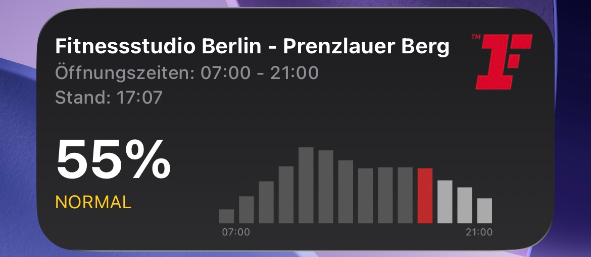
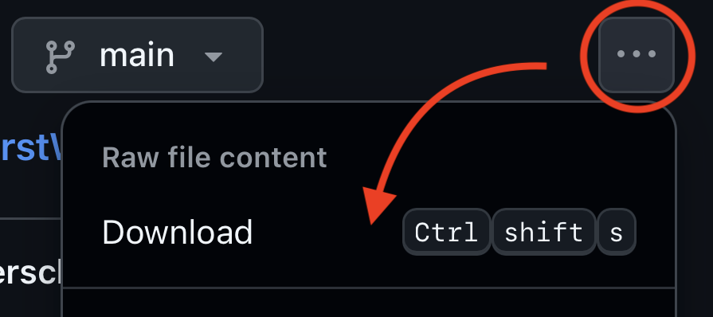
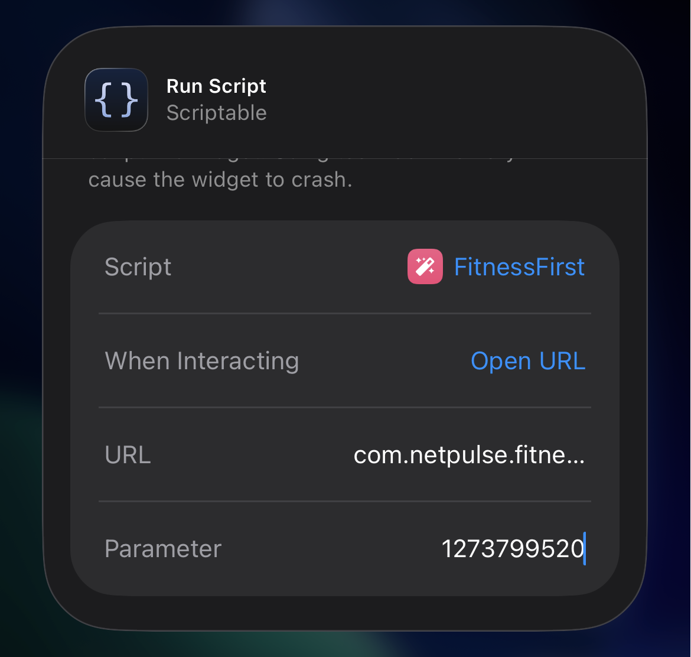

# FitnessFirst Occupancy Widget for iOS
A simple iOS widget that shows the current occupancy of FitnessFirst clubs, directly on your home screen. Stay informed and avoid crowded times effortlessly!

## Features
- Displays real-time occupancy of your selected FitnessFirst club.
- Fully customizable via Scriptable.
- Lightweight and easy to set up.

## Requirements
- iOS device
- Scriptable app installed

## Installation
1. Install [Scriptable](https://apps.apple.com/us/app/scriptable/id1405459188?uo=4)
2. Add the Widget Script
    - Download the [widget](https://github.com/jesperschlegel/FitnessFirstWidget/blob/main/fitnessFirstWidget.js) and click "Open In Scriptable" 
    - Click on "Add to my Scripts"
3. Find and copy the Club ID for your FitnessFirst location in the table below (last column)
4. Create the Widget on the Home Screen
    - Long press on your home screen and tap Edit Home Screen → + → Scriptable
    - Select the medium widget size
    - Select the script you just added
    - Tap Edit Widget and enter your Club ID as a parameter 

## Bonus
Set the widget option "When Interacting" to "Open URL" and enter `com.netpulse.fitnessfirst://` as the URL, for a click on the widget to open the FitnessFirst-App.

## ⚠️ Disclaimer
This project is not affiliated with, endorsed by, or in any way officially connected to Fitness First or any of its subsidiaries or partners.
All trademarks, brand names, and logos belong to their respective owners.
The widget uses publicly accessible data and is intended for personal and informational use only.
This widget collects anonymous usage statistics.

# Club IDs

| Name                                                    | ID         |
|---------------------------------------------------------|------------|
